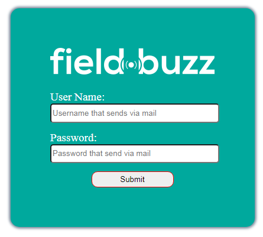
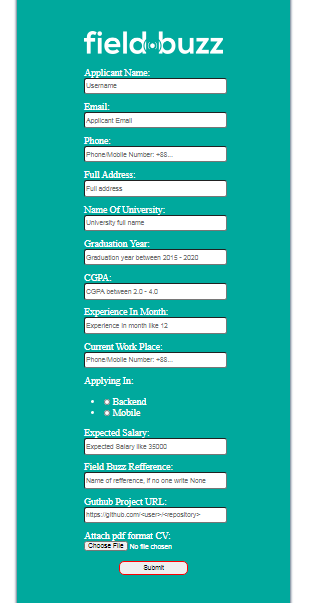
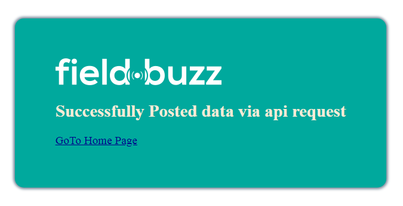

# Backend-API-Integration App
This is the coding assignment test for junior backend engineer at field buzz software ltd.
This test has 3 API endpoint,

1. Authentication Token API
2. Recruitment Information POST API
3. File Upload API

This App create a User Interface for login and Info form with Django Form and 
integrate them with API request and manipulate as required.

## Documentation:

### Dependencies or Tools requirments:

```bash
Python version 3.8.2
Django version 3.1.4
PIP version 20.3.1
Requests version 2.25.0
```

### Installation
> #### Python and pip installation

- Check the python official docs page for python and pip installation guide - [Python Official Docs](https://docs.python.org/3/)
- (You can also install virtual enviroment for a separate project working enviroment) - [Virtual Enviroment](https://uoa-eresearch.github.io/eresearch-cookbook/recipe/2014/11/26/python-virtual-env/)

> #### Project package install
- Activate Virtalul Enviroment (if any)
- Run the below command for install the required package

```bash
pip install -r requirements.txt
```

> #### Running/starting Project
- Run the below command and project should start at [localhost](https://127.0.0.1:8000). 

```bash
python manage.py runserver
```
- Request to the [localhost](https://127.0.0.1:8000) url.

> #### Usage manual
- Request to the [localhost](https://127.0.0.1:8000) you will find the home page.
- Enter the valid username and password and it sends to the submit form page.
- Enter data as mention in the form and all done. It gives a confirmation page.

> ## User Interface
  

## License
[MIT standard license](https://opensource.org/licenses/MIT)
